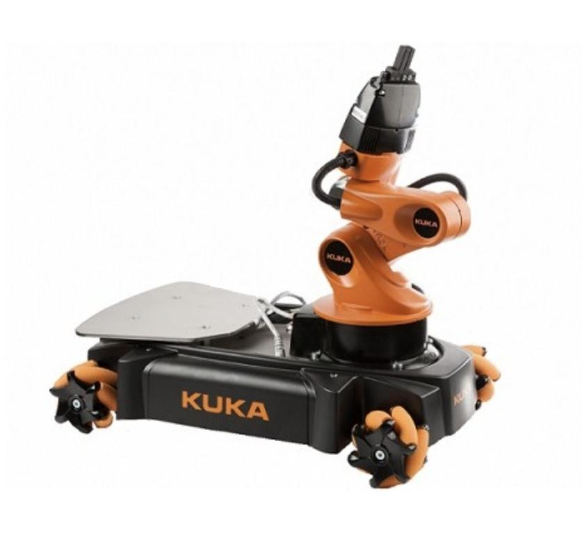
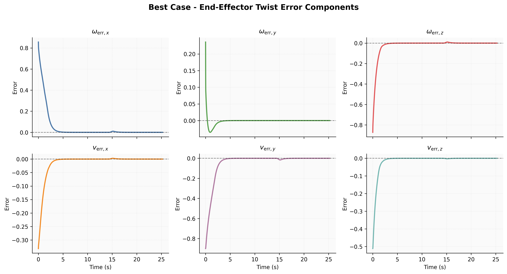
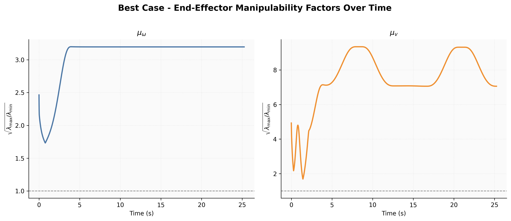

# KUKA youBot Mobile Manipulator Control Pipeline 

**Course:** MAE 204 - Robotics   
**Institution:** UC San Diego 

---

## Project Setup

This project simulates a pick-and-place task using a youBot mobile manipulator. The youBot platform consists of a mobile base equipped with four Mecanum wheels and a 5R kinematic arm. The robot's end-effector motion and object manipulation dynamics are simulated within CoppeliaSim using a pre-calculated sequence of kinematic configurations. 

---

## Mathematical/Theoretical Formulation

The core objective of the control software is to drive the end-effector twist error to zero using a combined feedforward and proportional-integral (PI) feedback control law. The error twist $X_{err}$ is extracted from the matrix logarithm of the transformation between the robot's current configuration and the desired reference configuration. 

The commanded task-space twist $\mathcal{V}(t)$ is calculated as:

$$
\mathcal{V}(t)=[Ad_{X^{-1}X_{d}}]\mathcal{V}_{d}(t)+K_{p}X_{err}(t)+K_{i}\int_{0}^{t}X_{err}(t)dt
$$ 

To map this task-space twist to the corresponding wheel and arm joint velocities $(u, \dot{\theta})$, the controller applies the Moore-Penrose pseudoinverse of the concatenated mobile manipulator Jacobian $J_{e}(\theta)$:

$$
\begin{bmatrix}u\\ \dot{\theta}\end{bmatrix}=J_{e}^{\dagger}(\theta)\mathcal{V}
$$ 

---

## Technical Approach

The software pipeline is structured into four primary components to achieve smooth mobile manipulation:

* **Kinematics Simulation:** Employs first-order Euler integration to predict the robot's subsequent configuration—updating arm joint angles, wheel angles, and chassis odometry—based on current states and commanded velocities.
* **Trajectory Generation:** Constructs an eight-segment reference trajectory for the end-effector to execute the pick-and-place sequence using screw trajectories. It explicitly inserts a 63-timestep buffer to accommodate the physical actuation delay of the CoppeliaSim gripper.
* **Feedforward + Feedback Control:** Implements the PI control law and uses a singularity-robust Jacobian pseudoinverse (applying a tolerance of 0.01) to prevent the controller from commanding infinite velocities near kinematic singularities, such as when the arm is fully extended.
* **Simulation Loop:** Orchestrates the pipeline by generating the full trajectory, iteratively computing the required control laws and next states, and logging the entire configuration history to a CSV file for visualization.

---

## Results

The control pipeline was tested across multiple scenarios to validate transient response and stability. 

* **Best Case:** Demonstrated clean, monotonic convergence of the twist error to zero using a well-tuned Feedforward + P controller.
* **Overshoot Case:** Illustrated integral windup and oscillatory transient behavior by introducing an aggressive integral gain to the controller.
* **New Task:** Verified the controller's versatility by successfully executing a custom pick-and-place operation with modified start and goal configurations.

---

## Video Links

The above video is for the best case scenario. Below are the video links for all three cases:

* [Best case video](https://drive.google.com/file/d/13AmKaYoUzJ41hXvFNVyeSKssX_F0vnRq/view?usp=sharing)
* [Overshoot case video](https://drive.google.com/file/d/1sCd94aVVWE_1Vc4gZzWzNzvgGZf7IMwj/view?usp=sharing)
* [New task video](https://drive.google.com/file/d/1roTeHDwBO1cRcbqnK-L8p-u8iOgbBv8y/view?usp=sharing)

## Full Project Report

For an in-depth analysis, comprehensive methodology, and a detailed discussion regarding manipulability factors and error convergence, please refer to the full project report included in this repository: 
[Final Project Report](autonomous_mobile_manipulation_report.pdf)
